# Despliegue de Aplicación Django + React

Este directorio contiene una  aplicación web con un backend en Django y un frontend en React.js, dockerizada y lista para ser desplegada tanto en un entorno local como en la nube utilizando AWS EC2.   
A continuación, encontrarás instrucciones detalladas para compilar y desplegar la aplicación.

## Requisitos Previos
Para poder compilar y desplegar la aplicación, necesitarás tener instalado lo siguiente:
- Docker: [Instalación de Docker](https://docs.docker.com/get-docker/)
- Docker Compose: [Instalación de Docker Compose](https://docs.docker.com/compose/install/)
- Cuenta de AWS: [Crear una cuenta de AWS](https://aws.amazon.com/es/)


## Desarrollo Local

### 1. Clonar el Repositorio
Clona este repositorio en tu máquina local:
```bash
git clone https://github.com/<tu-usuario>/<tu-repositorio>.git
cd <tu-repositorio>
```

### 2. Configurar archivo `.env`
En el directorio backend, crea un archivo .env con las variables de entorno necesarias.
```
SQL_ENGINE=django.db.backends.postgresql
SQL_DATABASE=core
SQL_USER=user
SQL_PASSWORD=password
SQL_HOST=db 
SQL_PORT=5432
```
Estas variables sirven para configurar la conexion a la base de datos de PostgreSQL.

### 3. Levantar la aplicación.
Dirigite a la raíz del proyecto y ejecuta el siguiente comando:
```bash
docker-compose up --build
```
### 4. Acceder a la aplicación.
- El Frontend de la aplicación se accede mediante: `http://localhost:3000`
- El Backend de la aplicación se accede mediante: `http://localhost:8000`

### 5. Detener la aplicación y limpiar los contenedores.
Para detener la aplicación y limpiar los contenedores, ejecuta el siguiente comando:
```bash
docker-compose down # Detiene los contenedores
docker-compose down -v # Detiene los contenedores y elimina los volúmenes
```

## Despliegue en la nube (AWS EC2)
Para el despliegue de la aplicación en la nube, se hara uso de un servidor EC2 de AWS.  
Se usará EC2 por sobre ECS ya que este requiere de un mayor nivel de configuración y es mejor para aplicaciones más complejas.   
A continuación, se detallan los pasos necesarios para desplegar la aplicación en un servidor EC2.

### 1. Crear una cuenta de AWS
1. Ve a la página de [AWS](https://aws.amazon.com/es/) y crea una cuenta.
2. Activa el nivel gratuito (free tier) para usar una instancia EC2 sin costo.

### 2. Lanzar una instancia EC2
#### 1. Ve a la consola de AWS y selecciona EC2.
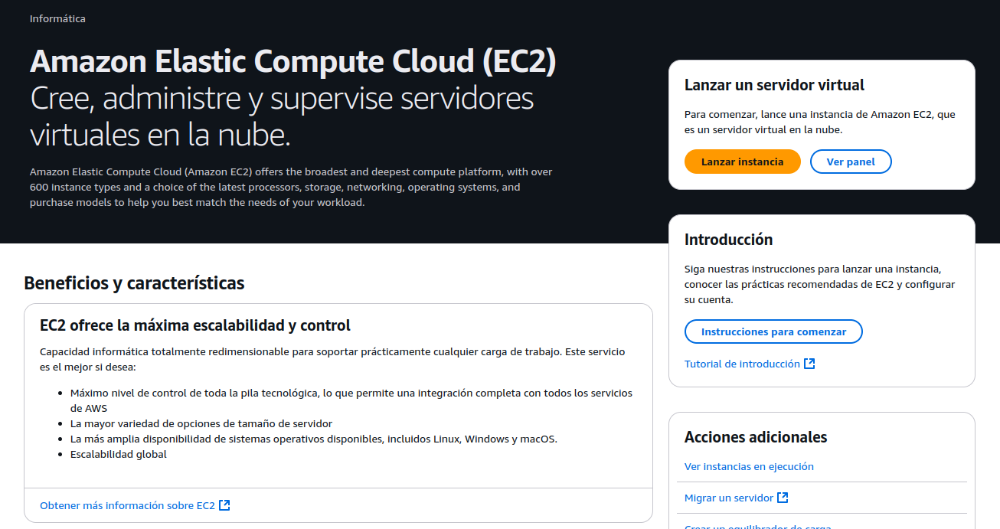
#### 2. Haz clic en "Lanzar Instancia" para lanzar una nueva instancia.

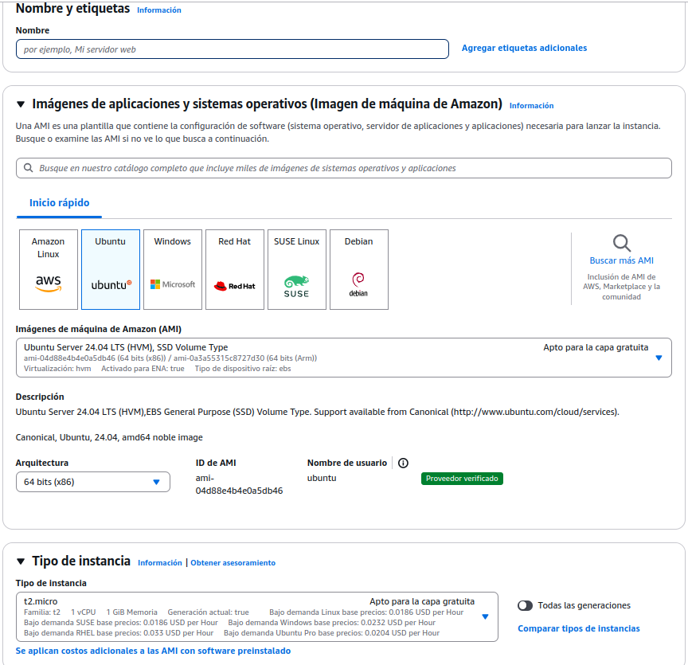

- **Nombre**: Asigna un nombre a tu instancia.
- **Sistema Operativo**: Selecciona ¨Ubuntu Server 20.04 LTS¨ (O una version reciente).
- **Tipo de Instancia**: Selecciona una instancia t2.micro.

### 3. Crea un par de claves.
#### 1. Crea un nuevo par de claves (elige RSA y formato `.pem`)
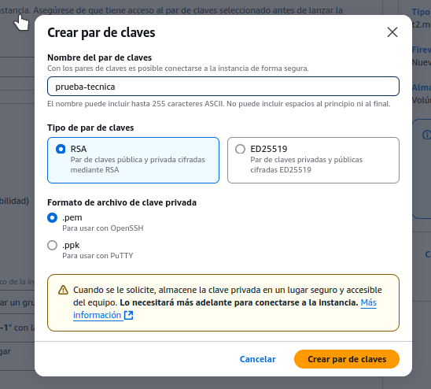

#### 2. Descarga el archivo `.pem` y guárdalo en un lugar seguro.

### 4. Configurar el Grupo de Seguridad.
#### Configuramos el grupo de seguridad para permitir el tráfico desde internet y restringir el acceso vía SSH a nuestra IP.
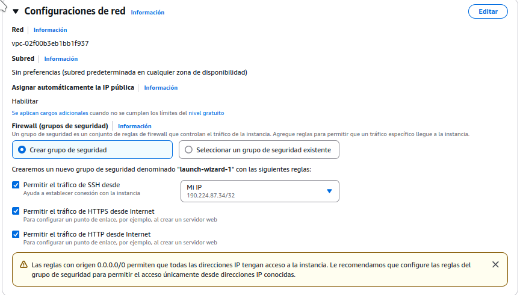

### 5. Lanzamos la instancia.
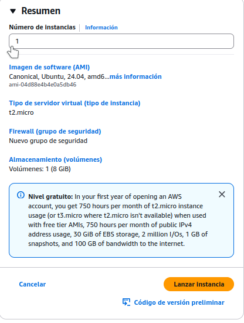


### 6. Conectarse a la instancia.
#### 1. Nos conectamos a la instancia via SSH utilizando el archivo `.pem` descargado.
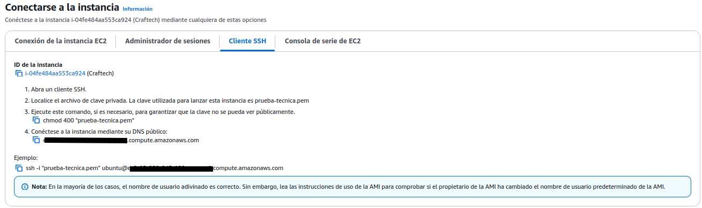
#### 2. Abrimos una terminal y nos dirigimos al directorio donde se encuentra el archivo `.pem`.
#### 3. Cambiamos los permisos del archivo `.pem`:
```bash
chmod 400 <nombre-archivo>.pem
```
#### 4. Nos conectamos a la instancia via SSH (reemplaza la IP con la IP pública de tu instancia):
```bash
ssh -i <nombre-archivo>.pem ubuntu@<ip-publica>
```
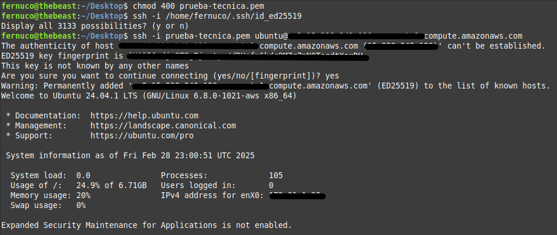


### 7. Instalar Docker y Docker Compose en la instancia.
#### 1. Actualizamos los paquetes:
```bash
sudo apt update
```
#### 2. Instalamos Docker:
```bash
sudo apt install -y docker.io
sudo systemctl start docker
sudo systemctl enable docker
sudo usermod -aG docker ubuntu
```
#### 3. Instalamos Docker Compose:
```bash
sudo curl -L "https://github.com/docker/compose/releases/latest/download/docker-compose-$(uname -s)-$(uname -m)" -o /usr/local/bin/docker-compose
sudo chmod +x /usr/local/bin/docker-compose
```
#### 4. Verificamos que Docker y Docker Compose se hayan instalado correctamente:
```bash
docker --version
docker-compose --version
```

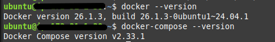

### 8. Clonamos el repositorio en la instancia.
```bash
git clone <url-repositorio>
cd <nombre-repositorio>
```
### 9. Transferimos el archivo `.env` desde nuestra máquina local a la instancia.
#### 1. En una terminal local, ejecutamos el siguiente comando para transferir el archivo `.env` a la instancia:
```bash
scp -i <nombre-archivo>.pem <ruta-archivo-env> ubuntu@<ip-publica>:~/<ruta-destino>
```

### 10. Configuramos los puertos de la instancia.
Queremos acceder a la aplicacion Frontend por el puerto 3000, al backend Django por el puerto 8000 y a PgAdmin4 por el puerto 5050.

#### 1. Buscamos la pestaña de "Seguridad" en la consola de EC2 y seleccionamos el grupo de seguridad de nuestra instancia.
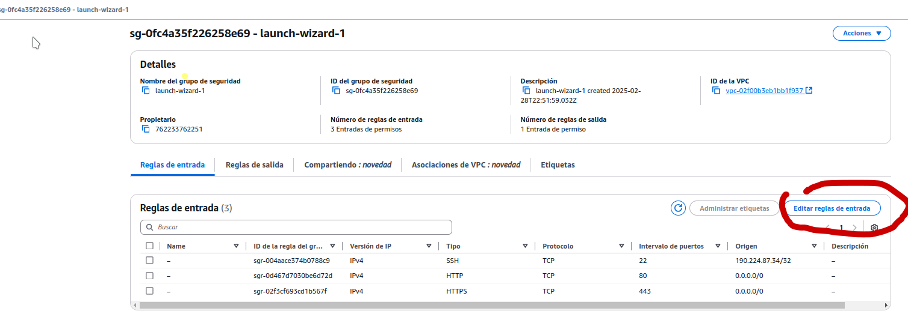

#### 2. Agregamos las reglas de entrada para los puertos 3000, 8000 y 5050.

### 11. Nos conectamos a la instancia y levantamos la aplicación.
```bash
docker-compose up --build
```
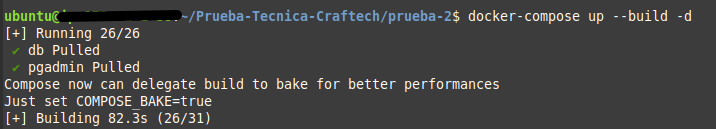


## Problemas Encontrados
### 1. Error al ejecutar `docker-compose up --build` en la instancia EC2.
Tuve un error al construir la imagen de Docker para el frontend, el problema radica en que se queda "colgado" en el paso `RUN npm install react-scripts@5.0.1 -g` de manera indefinida.

#### Soluciones Propuestas
El problema parece radicar en la falta de recursos de la instancia EC2 (t2.micro) para construir la imagen de Docker.   
Se proponen las siguientes soluciones:
1. **Aumentar la memoria de la instancia EC2**: Cambiar la instancia t2.micro a una más grande como t3.small
2. **Construir la imagen de Docker localmente**: Construir la imagen de Docker localmente y luego transferirla a la instancia EC2.


#### Solucion Implementada
Opté por cambiar la instancia t2.micro a una t3.small y volví a ejecutar el comando 
```bash
docker-compose up --build
```
Si bien se demora un poco más en construir la imagen, esta vez se completó exitosamente.

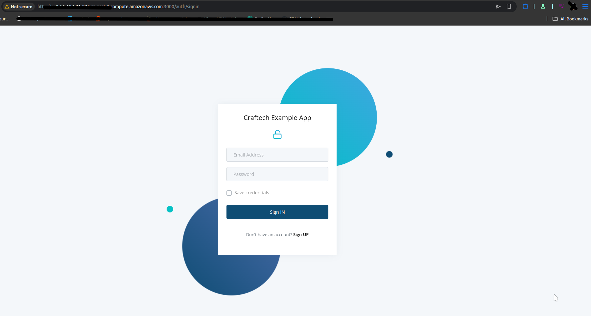
Como se puede apreciar en la imagen, la construcción de la imagen de Docker se completó exitosamente y la aplicacion se desplegó correctamente.
